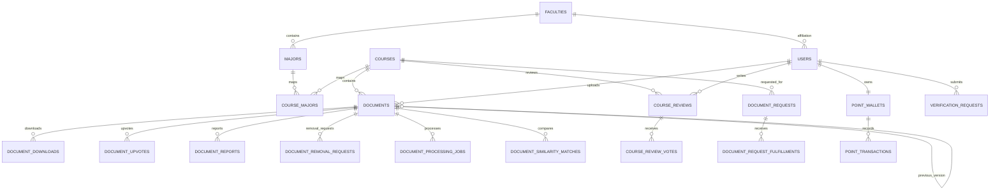

# ERD - AGU Academic Hub

```mermaid
erDiagram
    FACULTIES ||--o{ USERS : affiliation
    FACULTIES ||--o{ MAJORS : contains
    MAJORS ||--o{ COURSE_MAJORS : maps
    COURSES ||--o{ COURSE_MAJORS : maps
    COURSES ||--o{ DOCUMENTS : contains
    USERS ||--o{ DOCUMENTS : uploads
    DOCUMENTS o|--o{ DOCUMENTS : previous_version
    DOCUMENTS ||--o{ DOCUMENT_DOWNLOADS : downloads
    DOCUMENTS ||--o{ DOCUMENT_UPVOTES : upvotes
    DOCUMENTS ||--o{ DOCUMENT_REPORTS : reports
    DOCUMENTS ||--o{ DOCUMENT_REMOVAL_REQUESTS : removal_requests
    DOCUMENTS ||--o{ DOCUMENT_PROCESSING_JOBS : processes
    DOCUMENTS ||--o{ DOCUMENT_SIMILARITY_MATCHES : compares
    COURSES ||--o{ COURSE_REVIEWS : reviews
    USERS ||--o{ COURSE_REVIEWS : writes
    COURSE_REVIEWS ||--o{ COURSE_REVIEW_VOTES : receives
    COURSES ||--o{ DOCUMENT_REQUESTS : requested_for
    DOCUMENT_REQUESTS ||--o{ DOCUMENT_REQUEST_FULFILLMENTS : receives
    USERS ||--|| POINT_WALLETS : owns
    POINT_WALLETS ||--o{ POINT_TRANSACTIONS : records
    USERS ||--o{ VERIFICATION_REQUESTS : submits
```
